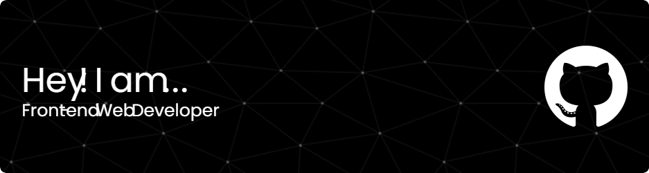

<h1 align="center">Hi 👋, I'm RedDragX</h1>
<h3 align="center">A passionate frontend developer from India</h3>

  

  

- 🔭 I’m currently working on [AstraX](n/a)

- 🌱 I’m currently learning **Frameworks,Libaries,etc**

- 👨‍💻 All of my projects are available at [https://github.com/RedDragX](https://github.com/RedDragX)

- 💬 Ask me about **JS,UI**

- 📫 How to reach me **gent.gamerz@gmail.com**

- ⚡ Fun fact **I love Photography more than Coding.**

<h3 align="left">Connect with me:</h3>

&nbsp;

